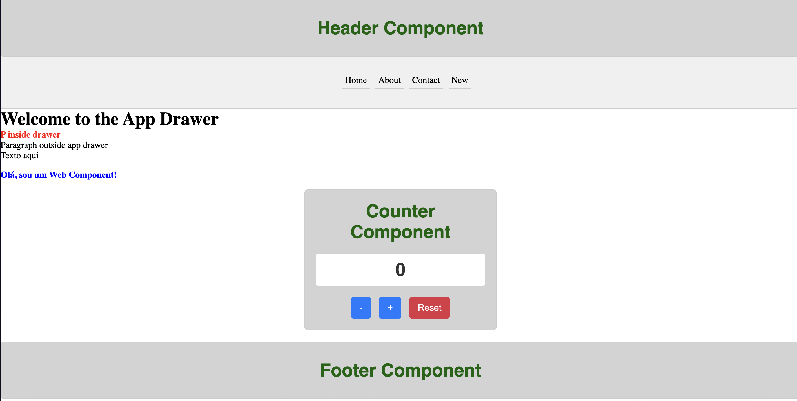

# Web Components POC

A proof of concept project demonstrating the use of native Web Components (Custom Elements) with vanilla HTML, CSS, and JavaScript.

## 📋 Overview

This project showcases the implementation of custom HTML elements using the Web Components standard, including:

- **Custom Elements**: Self-contained, reusable HTML elements
- **Shadow DOM**: Encapsulated styling and markup
- **HTML Templates**: Reusable document fragments

## 🚀 Getting Started

### Prerequisites

- Node.js (version 14 or higher)
- npm (comes with Node.js)

### Installation

1. Clone or download this repository
2. Navigate to the project directory:
   ```bash
   cd webcomponents
   ```

3. Install dependencies:
   ```bash
   npm install
   ```

### Running the Project

#### Development Server (Recommended)

Start the development server with live reload:

```bash
npm run dev
```

#### Basic Server

Start a basic HTTP server:

```bash
npm start
```

Both commands will serve the project locally. Open your browser and navigate to the provided local URL (typically `http://localhost:3000` or `http://localhost:5000`).

### Alternative: Direct File Opening

Since this project uses only vanilla HTML/CSS/JS, you can also open `index.html` directly in your browser. However, using a local server is recommended to avoid issues with ES modules.

## 🌟 Features

- **No Framework Dependencies**: Pure Web Components using browser APIs
- **Shadow DOM Encapsulation**: Isolated styling for each component
- **Reusable Components**: Easy to integrate and customize
- **ES Modules**: Modern JavaScript module system
- **Responsive Design**: Mobile-friendly components

## 📚 Learning Resources

- [MDN Web Components Guide](https://developer.mozilla.org/en-US/docs/Web/Web_Components)
- [Custom Elements Specification](https://html.spec.whatwg.org/multipage/custom-elements.html)
- [Shadow DOM Specification](https://dom.spec.whatwg.org/#shadow-trees)

## Results
